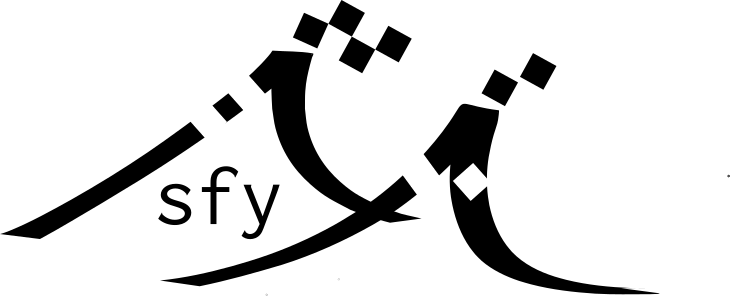

# The small friendly buoy
<table>
    <tr>
        <td>
            
        </td>
        <td>

* [sfy-buoy](sfy-buoy/) - the firmware for the wave buoy.
* [sfy-drifter](sfy-drifter/) - a minimal, modem & gps, only drifter buoy.
* [hardware and build-tutorial](hardware/Hardware.md) - hardware and assembly instructions.
* [sfy-data](sfy-data/) - the server scraping or receiving data from deployed
    buoys.
* [sfy-processing](sfy-processing/) - python libraries and tools for reading and post-processing received data.
* [sfy-dashboard](sfy-dashboard/) - web interface for displaying latest position
    and overview of buoys.
        </td>
    </tr>

</table>

The buoys deployed in the surf on the coast of Norway:

For more information and attribution, please refer to:
* [Hope, Gaute, et al., 2024, (pre-print), SFY -- A lightweight, high-frequency and phase-resolving wave-buoy for coastal waters](https://arxiv.org/abs/2401.02286)
* [Seldal, Torunn Irene, M. Sc. thesis, 2023, _SFY: A free-drifting wave buoy for measuring surf waves_](https://bora.uib.no/bora-xmlui/handle/11250/3072146)

# Press

* [met.no - Morgendagens fiskere utdanner seg til en framtid med store endringer](https://www.met.no/nyhetsarkiv/morgendagens-fiskere-utdanner-seg-til-en-framtid-med-store-endringer)
* [met.no - Surfer rundt i verden for å måle hvordan bølger bryter](https://www.met.no/nyhetsarkiv/surfer-rundt-i-verden-for-a-male-hvordan-bolger-bryter)

# Acknowledgements

This work is inspired by the [OpenMetBuoy-v2021a](https://github.com/jerabaul29/OpenMetBuoy-v2021a), see [Rabault et. al. (2022)](https://www.mdpi.com/2076-3263/12/3/110).
