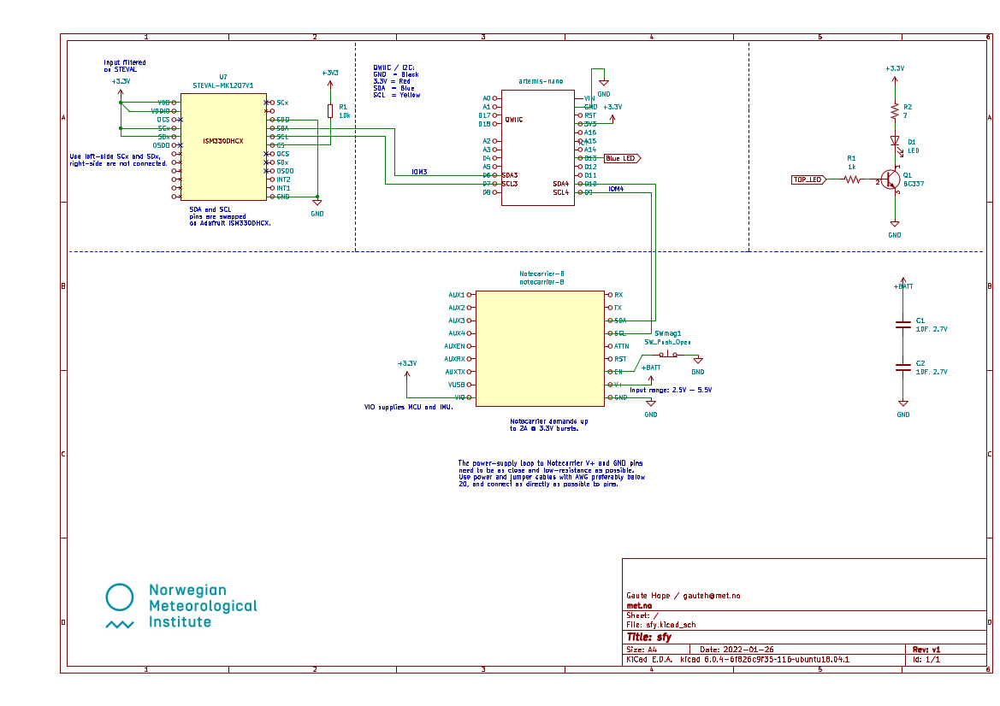

# Hardware

schematic: [(pdf)](sfy-schema-v1.pdf) | [(kicad)](sfy/)

See this detailed guide on hackster.io on how to build and assemble the buoy:
[Ocean Buoy to Measure Waves and Drift using Low-Power Cellular](https://www.hackster.io/gaute-hope/ocean-buoy-to-measure-waves-drift-using-low-power-cellular-16ad09).
