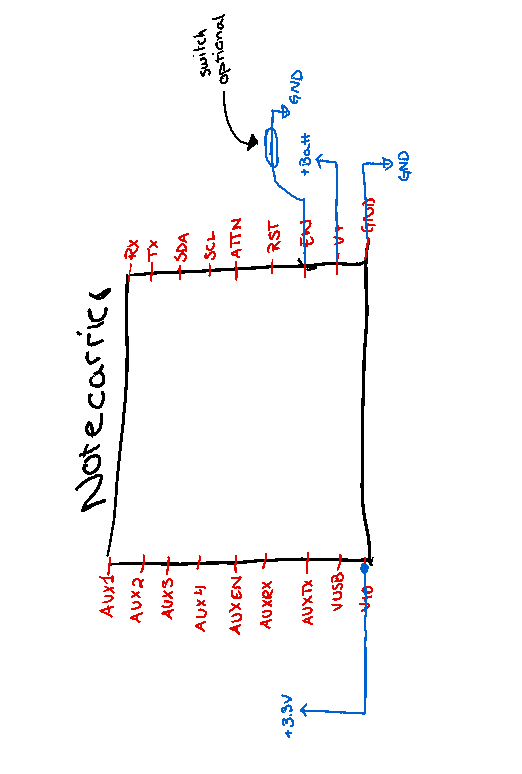

# Ocean Drifter

### Components

- [Blues Notecard](https://blues.io/products/notecard/?utm_source=hackster&utm_medium=web&utm_campaign=hackster-bounty)
- [Blues Notecarrier B](https://shop.blues.io/products/carr-b?utm_source=hackster&utm_medium=web&utm_campaign=hackster-bounty)
- Protoboard of choice (we used 1/4 sized)
- GPS and Cellular antenna
- Solid-core wire (jumper wires)
- Battery-housing
- Batteries: Alkaline
- Bottle or suitable enclosure

#### Optional

- Magnetic reed switch + magnet (if you want the option to turn it off with disconnecting from the batteries)

### Assemble

 
 
- see pictures

#### Configuration of Notecard

How to configurate the notecard using [Notecard CLI](https://dev.blues.io/notecard-playground/?utm_source=hackster&utm_medium=web&utm_campaign=anti-theft-notecard).

1. **Connect the notecard to your computer with a USB cable.**

2. **Attach the notecard/drifter to a Notehub project with *hub.set***

	- Ex: *{"req":"hub.set","product":"no.met.gauteh:sfy","sn":"DRIFTER$$", "outbound":20}*
 	- product: name of project
	- sn: name of drifter
	- outbound: When drifter is in motion this is the max time, in minutes, before the drifter 				synchronizes the data from the Notecard to Notehub.

2. **Set notecard´s mode and frequency of location detection with *card.loacation.mode***
	- Ex: *{"req":"card.location.mode","mode":"periodic","seconds":600}*
	- mode:how often it should sample. If periodic it will sample only at set intervals
	- seconds: Sampling intervals given in seconds

3. **Start tracking using *card.location.track***
	- Ex: *{"req":"card.location.track","start":true,"heartbeat":true,"hours":1}*
	- heartbeat: If "true" enables tracking even when motion is not detected.
	- hours: sample interval for heartbeat, given in hours.

