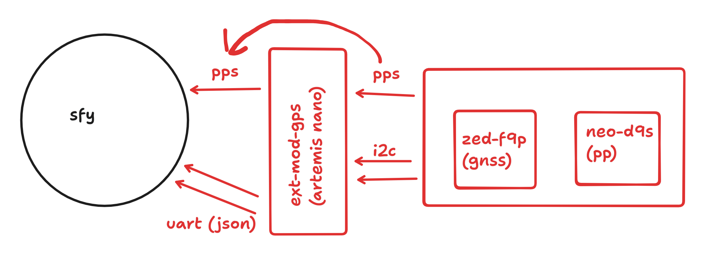

# SFY with RTK relay

[ sfy ] <-- [ ext-gps-mod ] <-- [ Ublox RTK-GPS ]

## Communication

ext-gps-mod runs arduino code to read ublox data. it decodes and transmits those
to the sfy as JSON.

The sfy reads JSON and sends those data using the notecard.

## Synchronization

ext-gps-mod:
* PPS from ublox.
* AutoPVT from ublox.

sfy:
* PPS from ext-gps-mod
* GPS data from UART.

Notes:
* If there are more than one telegram on the UART we have lost synchronization.

## Timeline

If all of this happens in less than 1 ms we are happy:

- Ublox PVT updated ( 20 Hz)
- Ublox PPS -> ext-gps-mod
- pps_time = ext-gps-mod.micros()
- ext-gps-mod PPS -> SFY
- SFY: stores sfy_pps_time: for incoming PVT telegram
- read_time = ext-gps-mod.micros()
- ext-gps-mod reads PVT related to PPS. Is the T updated or is it fixed to the
    PPS? maybe all of this is fast enough to ignore.
- ext-gps-mod push PVT to SFY + (read_time - pps_time)
- sfy_read_time = sfy.micros()/RTC
- SFY reads PVT related to PPS
- SFY sets local time to T + (sfy_read_time - sfy_pps_time)
